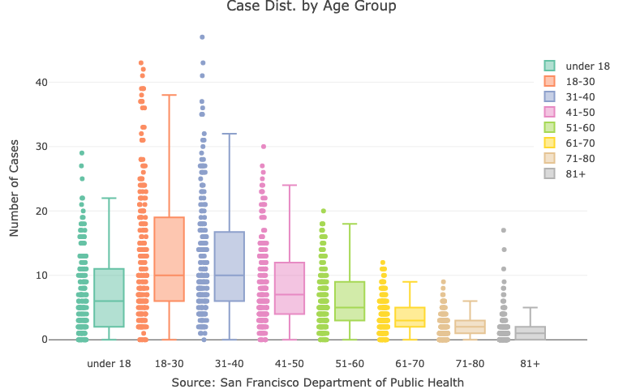
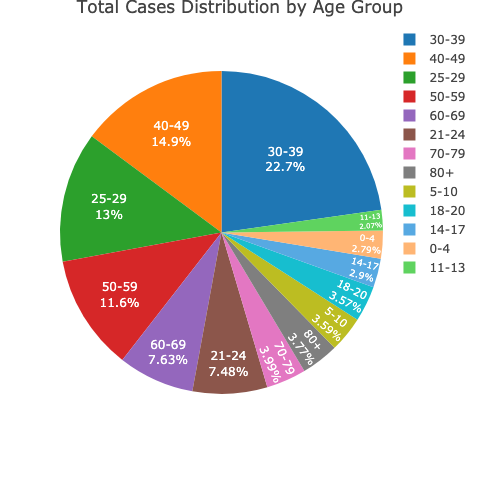
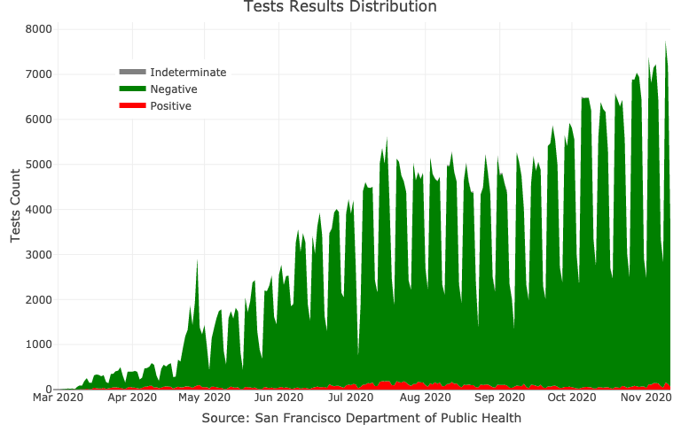

<!-- README.md is generated from README.Rmd. Please edit that file -->

```{r, include = FALSE}
knitr::opts_chunk$set(
  collapse = TRUE,
  comment = "#>",
  fig.path = "man/figures/README-",
  out.width = "100%"
)

`%>%` <- magrittr::`%>%`
```

# covid19sf

<!-- badges: start -->
[](https://github.com/RamiKrispin/covid19sf/actions)
[](https://cran.r-project.org/package=covid19sf)
[](https://www.tidyverse.org/lifecycle/#experimental)
[](https://opensource.org/licenses/MIT)
[](https://github.com/RamiKrispin/covid19sf/commit/master)
<!-- badges: end -->

The covid19sf package provides a daily summary of the covid19 cases in San Francisco. The package includes the following datasets:

* `covid19sf_age` -  Cases summarized by age group
* `covid19sf_demo` -  Cases summarized by date, transmission and case disposition
* `covid19sf_gender` -  Confirmed cases summarized by gender
* `covid19sf_geo` -  Confirmed cases and deaths summarized by geography
* `covid19sf_homeless` -  Confirmed cases by homelessness
* `covid19sf_hospital` -  Hospital capacity data
* `covid19sf_hospitalizations` -  Hospitalizations data
* `covid19sf_housing` -  Alternative housing sites
* `covid19sf_summary` -  Cases summarized by date, transmission and case disposition
* `covid19sf_test_loc` -  Testing locations
* `covid19sf_tests` -  Daily number of tests


**Data soucre:** San Francisco, Department of Public Health - Population Health Division through the San Francisco [Opne Data protal website](https://datasf.org/opendata/)

<a href='https://ramikrispin.github.io/covid19sf/index.html/'></a>

## Installation


``` r
# install.packages("devtools")
devtools::install_github("RamiKrispin/covid19sf")
```
## Usage

The **ccovid19sf** package provides different views for the covid19 cases in San Francisco. That includes case distribution by age, gender, race, etc. The following examples demonstrate some of the data use cases.

```{r example}
library(covid19sf)
```


### Cases distribution by age

The covid19sf_age provides a daily summary of the cumulative positive cases by age group:

```{r}
data(covid19sf_age)

head(covid19sf_age)
```


The following box-plot shows the distribution of the positive cases by age group:

```r
library(plotly)

covid19sf_age$age_group <- factor(covid19sf_age$age_group, 
                                  levels = c("under 18",  "18-30", 
                                             "31-40", "41-50",
                                             "51-60", "61-70",
                                             "71-80","81+"))

plot_ly(covid19sf_age, 
        color = ~ age_group, 
        y = ~ new_confirmed_cases, 
        boxpoints = "all", 
        jitter = 0.3,
        pointpos = -1.8,
        type = "box" ) %>%
layout(title = "Case Dist. by Age Group",
       yaxis = list(title = "Number of Cases"),
       xaxis = list(title = "Source: San Francisco Department of Public Health"),
       legend = list(x = 0.9, y = 0.9))
```

```{r include=FALSE}
library(plotly)

covid19sf_age$age_group <- factor(covid19sf_age$age_group, 
                                  levels = c("under 18",  "18-30", 
                                             "31-40", "41-50",
                                             "51-60", "61-70",
                                             "71-80","81+"))

p1 <- plotly::plot_ly(covid19sf_age, 
                color = ~ age_group, 
                y = ~ new_confirmed_cases, 
                boxpoints = "all", 
                jitter = 0.3,
                pointpos = -1.8,
                type = "box" ) %>%
  layout(title = "Case Dist. by Age Group",
         yaxis = list(title = "Number of Cases"),
         xaxis = list(title = "Source: San Francisco Department of Public Health"),
         legend = list(x = 0.9, y = 0.9))

orca(p1, "man/figures/age_dist1.png")
```





``` r
library(dplyr)
library(plotly)
covid19sf_age %>% 
  filter(specimen_collection_date == max(specimen_collection_date)) %>%
  plot_ly(values = ~ cumulative_confirmed_cases, 
          labels = ~ age_group, 
          type = "pie",
          textposition = 'inside',
          textinfo = 'label+percent',
          insidetextfont = list(color = '#FFFFFF'),
          hoverinfo = 'text',
          text = ~paste("Age Group:", age_group, "<br>",
                        "Total:", cumulative_confirmed_cases)) %>%
  layout(title = paste("Total Cases Distribution by Age Group as of ", ~ max(specimen_collection_date)))
```

```{r include=FALSE}
library(dplyr)
library(plotly)
p <- covid19sf_age %>% 
  filter(specimen_collection_date == max(specimen_collection_date)) %>%
  plot_ly(values = ~ cumulative_confirmed_cases, 
          labels = ~ age_group, 
          type = "pie",
          textposition = 'inside',
          textinfo = 'label+percent',
          insidetextfont = list(color = '#FFFFFF'),
          hoverinfo = 'text',
          text = ~paste("Age Group:", age_group, "<br>",
                        "Total:", cumulative_confirmed_cases)) %>%
  layout(title = paste("Total Cases Distribution by Age Group as of ",max(covid19sf_age$specimen_collection_date)))

orca(p, "man/figures/age_dist2.png")
```




### Tests results distribution


```{r}
data(covid19sf_tests)

head(covid19sf_tests)
```


```r
covid19sf_tests %>%
plotly::plot_ly(x = ~ specimen_collection_date,
                y = ~ pos,
                name = "Positive",
                type = 'scatter', 
                mode = 'none', 
                stackgroup = 'one',
                fillcolor = "red") %>%
  plotly::add_trace(y = ~ neg, name = "Negative", fillcolor = "green") %>%
  plotly::add_trace(y = ~ indeterminate, name = "Indeterminate", fillcolor = "gray") %>%
  plotly::layout(title = "Tests Results Distribution",
                 yaxis = list(title = "Tests Count"),
                 xaxis = list(title = "Source: San Francisco Department of Public Health"),
                 legend = list(x = 0.1, y = 0.9))
```


```{r include=FALSE}

p <- covid19sf_tests %>%
  plotly::plot_ly(x = ~ specimen_collection_date,
                y = ~ pos,
                name = "Positive",
                type = 'scatter', 
                mode = 'none', 
                stackgroup = 'one',
                fillcolor = "red") %>%
  plotly::add_trace(y = ~ neg, name = "Negative", fillcolor = "green") %>%
  plotly::add_trace(y = ~ indeterminate, name = "Indeterminate", fillcolor = "gray") %>%
  plotly::layout(title = "Tests Results Distribution",
                 yaxis = list(title = "Tests Count"),
                 xaxis = list(title = "Source: San Francisco Department of Public Health"),
                 legend = list(x = 0.1, y = 0.9))

orca(p, "man/figures/test_dist.png")
```




