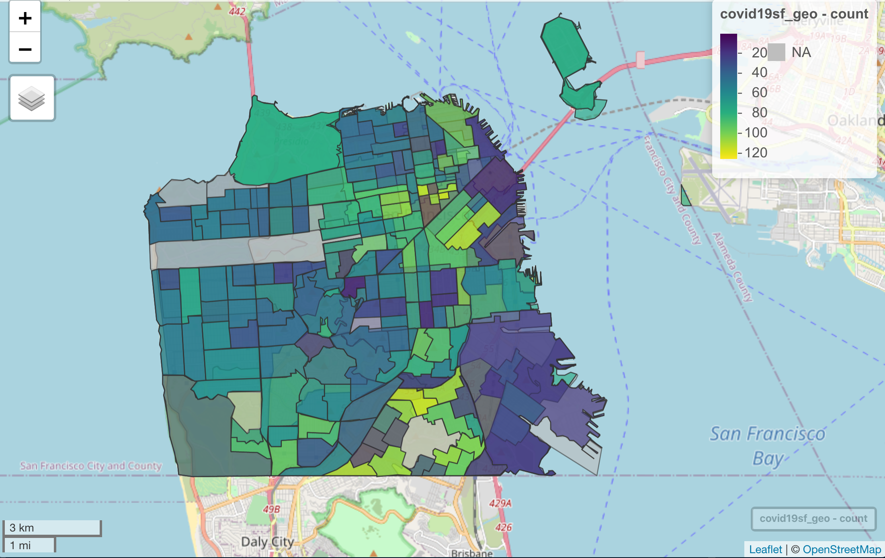

<!-- README.md is generated from README.Rmd. Please edit that file -->

# covid19sf

<!-- badges: start -->

[](https://github.com/RamiKrispin/covid19sf/actions)
[](https://cran.r-project.org/package=covid19sf)
[](https://www.tidyverse.org/lifecycle/#experimental)
[](https://opensource.org/licenses/MIT)
[](https://github.com/RamiKrispin/covid19sf/commit/master)
<!-- badges: end -->

The covid19sf package provides a daily summary of the covid19 cases in
San Francisco. The package includes the following datasets:

  - `covid19sf_age` - Cases summarized by age group
  - `covid19sf_demo` - Cases summarized by date, transmission and case
    disposition
  - `covid19sf_gender` - Confirmed cases summarized by gender
  - `covid19sf_geo` - Confirmed cases and deaths summarized by geography
  - `covid19sf_homeless` - Confirmed cases by homelessness
  - `covid19sf_hospital` - Hospital capacity data
  - `covid19sf_hospitalizations` - Hospitalizations data
  - `covid19sf_housing` - Alternative housing sites
  - `covid19sf_summary` - Cases summarized by date, transmission and
    case disposition
  - `covid19sf_test_loc` - Testing locations
  - `covid19sf_tests` - Daily number of tests

<a href='https://ramikrispin.github.io/covid19sf/index.html/'></a>

## Installation

``` r
# install.packages("devtools")
devtools::install_github("RamiKrispin/covid19sf")
```

## Usage

WIP…

``` r
library(covid19sf)
## basic example code
```
