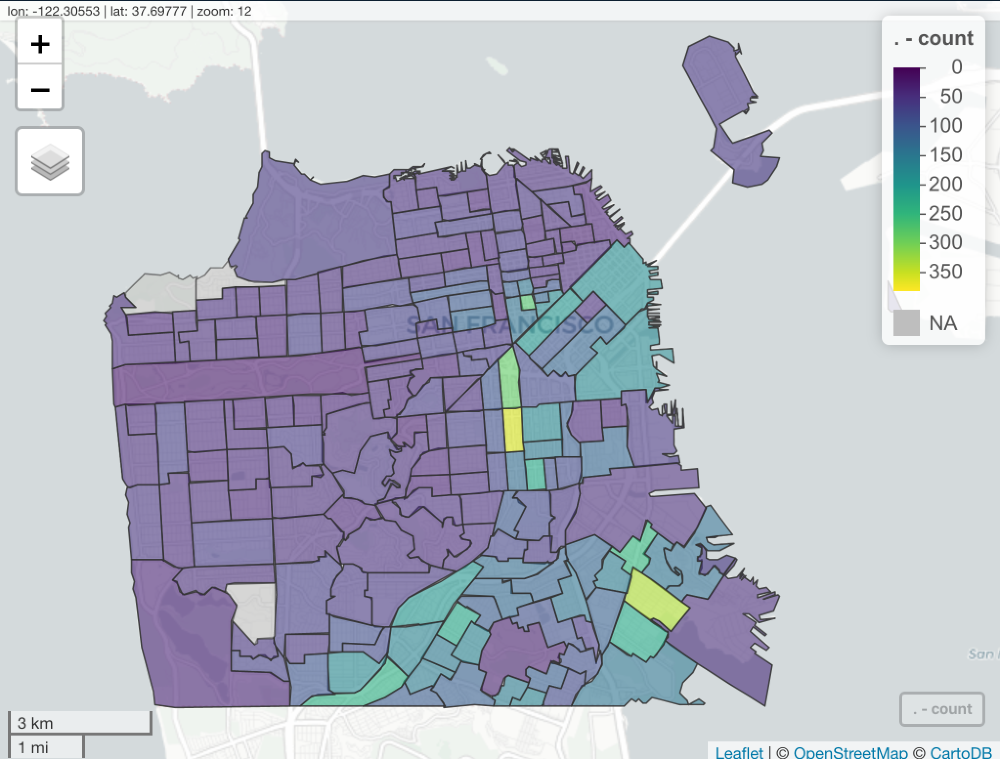
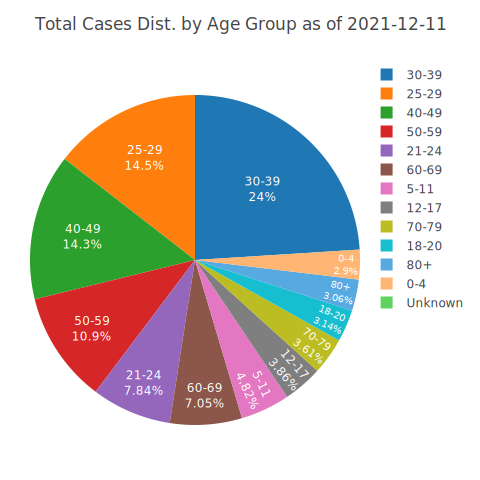
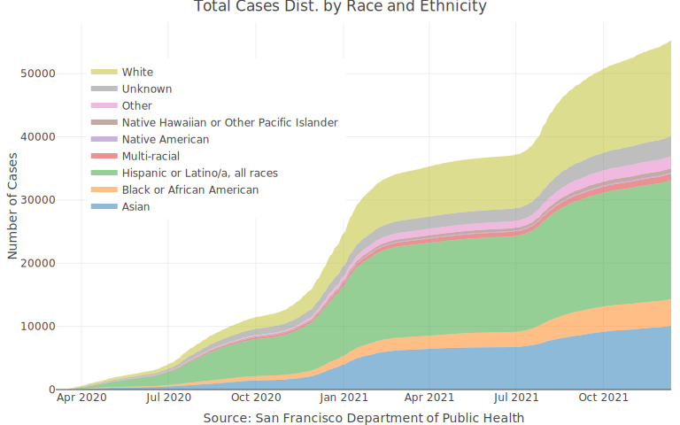

<!-- README.md is generated from README.Rmd. Please edit that file -->

# covid19sf

<!-- badges: start -->

[](https://github.com/RamiKrispin/covid19sf/actions)
[](https://cran.r-project.org/package=covid19sf)
[](https://lifecycle.r-lib.org/articles/stages.html)
[](https://opensource.org/licenses/MIT)
[](https://github.com/RamiKrispin/covid19sf/commit/master)
<!-- badges: end -->

The covid19sf package provides a daily summary of the covid19 cases in
San Francisco. The package includes the following datasets:

-   `covid19sf_geo` - Confirmed cases and deaths summarized by geography
-   `covid19sf_hospital` - Hospital capacity data
-   `covid19sf_hospitalizations` - Hospitalizations data
-   `covid19sf_housing` - Alternative housing sites
-   `covid19sf_test_loc` - Testing locations
-   `covid19sf_tests` - Daily number of tests
-   `covid19sf_vaccine_demo` - Summary of vaccine doses given to San
    Franciscans by demographics groups (age and race)
-   `covid19sf_vaccine_demo_ts` - Time series view of vaccine doses
    given to San Franciscans by demographics groups (age and race)
-   `covid19sf_vaccine_geo` - COVID-19 vaccines given to San Franciscans
    by geography
-   `covid19sf_population` - COVID-19 cases by population
    characteristics over time

The following dataset were deprecated and replaced by the
`covid19sf_population` dataset:

-   `covid19sf_demo`- Cases summarized by date, transmission and case
    disposition
-   `covid19sf_homeless` - Confirmed cases by homelessness
-   `covid19sf_age` - Cases summarized by age group
-   `covid19sf_gender` - Confirmed cases summarized by gender
-   `covid19sf_summary` - Cases summarized by date, transmission and
    case disposition

**Data soucre:** San Francisco, Department of Public Health - Population
Health Division through the San Francisco [Opne Data protal
website](https://datasf.org/opendata/)

<a href='https://ramikrispin.github.io/covid19sf/'></a>

## Installation

``` r
# install.packages("devtools")
devtools::install_github("RamiKrispin/covid19sf")
```

## Usage

The **ccovid19sf** package provides different views for the covid19
cases in San Francisco. That includes case distribution by age, gender,
race, etc. The following examples demonstrate some of the data use
cases.

``` r
library(covid19sf)
```

### Cases distribution by demographic

The `covid19sf_population` provides a daily summary of new and
cumulative positive cases by the following demograpich groups:

-   Age group
-   Comorbidities
-   Gender
-   Homelessness
-   Race/Ethnicity
-   Sexual Orientation
-   Single Room Occupancy Tenancy
-   Skilled Nursing Facility Occupancy
-   Transmission Type

``` r
data(covid19sf_population)

head(covid19sf_population)
#>   specimen_collection_date characteristic_type characteristic_group
#> 1               2020-03-03           Age Group                  0-4
#> 2               2020-03-03           Age Group                 5-11
#> 3               2020-03-03           Age Group                12-17
#> 4               2020-03-03           Age Group                18-20
#> 5               2020-03-03           Age Group                21-24
#> 6               2020-03-03           Age Group                25-29
#>   characteristic_group_sort_order new_cases cumulative_cases
#> 1                               1        NA               NA
#> 2                               2        NA               NA
#> 3                               3        NA               NA
#> 4                               4        NA               NA
#> 5                               5        NA               NA
#> 6                               6        NA               NA
#>   population_estimate
#> 1               39353
#> 2               44153
#> 3               34664
#> 4               20407
#> 5               39944
#> 6              100792
```

#### Cases distribution by age

To get cases view by age group we will use the `characteristic_type`
variable to filter the data:

``` r
library(dplyr)
#> 
#> Attaching package: 'dplyr'
#> The following objects are masked from 'package:stats':
#> 
#>     filter, lag
#> The following objects are masked from 'package:base':
#> 
#>     intersect, setdiff, setequal, union

df_age <- covid19sf_population %>%
  filter(characteristic_type == "Age Group")

head(df_age)
#>   specimen_collection_date characteristic_type characteristic_group
#> 1               2020-03-03           Age Group                  0-4
#> 2               2020-03-03           Age Group                 5-11
#> 3               2020-03-03           Age Group                12-17
#> 4               2020-03-03           Age Group                18-20
#> 5               2020-03-03           Age Group                21-24
#> 6               2020-03-03           Age Group                25-29
#>   characteristic_group_sort_order new_cases cumulative_cases
#> 1                               1        NA               NA
#> 2                               2        NA               NA
#> 3                               3        NA               NA
#> 4                               4        NA               NA
#> 5                               5        NA               NA
#> 6                               6        NA               NA
#>   population_estimate
#> 1               39353
#> 2               44153
#> 3               34664
#> 4               20407
#> 5               39944
#> 6              100792
```

Ordering the age groups before plotting the cases distribution:

``` r
age_order <- df_age %>% 
  select(characteristic_group, characteristic_group_sort_order) %>%
  distinct() %>%
  arrange(characteristic_group_sort_order)
  

df_age$characteristic_group <- factor(df_age$characteristic_group, levels = age_order$characteristic_group)
```

The following box-plot shows the distribution of the positive cases by
age group:

``` r
library(plotly)

plot_ly(df_age, 
        color = ~ characteristic_group, 
        y = ~ new_cases, 
        boxpoints = "all", 
        jitter = 0.3,
        pointpos = -1.8,
        type = "box" ) %>%
layout(title = "Distribution of Daily New COVID-19 Cases in San Francisco by Age Group",
       yaxis = list(title = "Number of Cases"),
       xaxis = list(title = "Source: San Francisco Department of Public Health"),
       legend = list(x = 0.9, y = 0.9),
       margin = list(t = 60, b = 60, l = 60, r = 60))
```


Here is the overall distribution of cases by age group as of 2021-12-11:

``` r
df_age %>% 
  filter(specimen_collection_date == max(specimen_collection_date)) %>%
  plot_ly(values = ~ cumulative_cases, 
          labels = ~ characteristic_group, 
          type = "pie",
          textposition = 'inside',
          textinfo = 'label+percent',
          insidetextfont = list(color = '#FFFFFF'),
          hoverinfo = 'text',
          text = ~paste(" Age Group:", characteristic_group, "<br>",
                        "Total:", cumulative_cases, "<br>",
                        "Population Estimation:", population_estimate, 
                        paste("(",round(100* cumulative_cases/population_estimate, 1) ,"%)", sep = ""))) %>%
   layout(title = ~ paste("Total Cases Dist. by Age Group as of", max(specimen_collection_date)),
       margin = list(t = 60, b = 20, l = 30, r = 60))
```



### Geospatial visualiztion

The package provides several geo-spatial dataset:

-   `covid19sf_vaccine_geo` - COVID-19 vaccines given to San Franciscans
    by geography
-   `covid19sf_geo` - Confirmed cases and deaths summarized by geography
-   `covid19sf_test_loc` - Testing locations

Those three datasets are `sf` objects, ready to use. For example,
plotting the COVID19 vaccination data by geography:

``` r
library(sf)
#> Linking to GEOS 3.8.1, GDAL 3.2.1, PROJ 7.2.1

data(covid19sf_vaccine_geo)

str(covid19sf_vaccine_geo)
#> Classes 'sf' and 'data.frame':   40 obs. of  9 variables:
#>  $ id                          : chr  "Bernal Heights" "Financial District/South Beach" "Glen Park" "Haight Ashbury" ...
#>  $ area_type                   : chr  "Analysis Neighborhood" "Analysis Neighborhood" "Analysis Neighborhood" "Analysis Neighborhood" ...
#>  $ count_vaccinated_by_dph     : num  5106 1841 573 823 2401 ...
#>  $ count_vaccinated            : num  21109 22782 7257 14360 16351 ...
#>  $ count_series_completed      : num  19781 20215 6804 13279 14930 ...
#>  $ acs_population              : num  25167 21537 8651 19275 19711 ...
#>  $ percent_pop_series_completed: num  0.786 0.939 0.786 0.689 0.757 ...
#>  $ last_updated                : POSIXct, format: "2021-12-15 04:45:07" "2021-12-15 04:45:09" ...
#>  $ geometry                    :sfc_MULTIPOLYGON of length 40; first list element: List of 1
#>   ..$ :List of 1
#>   .. ..$ : num [1:195, 1:2] -122 -122 -122 -122 -122 ...
#>   ..- attr(*, "class")= chr [1:3] "XY" "MULTIPOLYGON" "sfg"
#>  - attr(*, "sf_column")= chr "geometry"
#>  - attr(*, "agr")= Factor w/ 3 levels "constant","aggregate",..: NA NA NA NA NA NA NA NA
#>   ..- attr(*, "names")= chr [1:8] "id" "area_type" "count_vaccinated_by_dph" "count_vaccinated" ...

df <- covid19sf_vaccine_geo %>% filter(area_type == "Analysis Neighborhood") %>%
  dplyr::mutate(perc_complated = percent_pop_series_completed * 100)
```

We will plot the object Using the **sf** package:

``` r
plot(df[, c("perc_complated", "geometry")],
     main = "San Francisco - Percentage of Fully Vaccinated Population by Geo",
     key.pos = 1, axes = TRUE, key.width = lcm(1.2), key.length = 1.0)
```


More examples available on this
[vignette](https://ramikrispin.github.io/covid19sf/articles/geo.html).

### Tests results distribution

The covid19sf_tests provides a daily summary of the daily number of
tests and their results (positive, negative, and indeterminate):

``` r
data(covid19sf_tests)

head(covid19sf_tests)
#>   specimen_collection_date tests pos        pct neg indeterminate
#> 1               2020-03-01     2   0 0.00000000   2             0
#> 2               2020-03-03     8   2 0.25000000   6             0
#> 3               2020-03-04    12   0 0.00000000  12             0
#> 4               2020-03-06    21   1 0.04761905  20             0
#> 5               2020-03-07    23   7 0.30434783  16             0
#> 6               2020-03-08    12   3 0.25000000   9             0
```

The plot below shows the daily distribution of the results of the tests:

``` r
covid19sf_tests %>%
plotly::plot_ly(x = ~ specimen_collection_date,
                y = ~ pos,
                name = "Positive",
                type = 'scatter', 
                mode = 'none', 
                stackgroup = 'one',
                fillcolor = "red") %>%
  plotly::add_trace(y = ~ neg, name = "Negative", fillcolor = "green") %>%
  plotly::add_trace(y = ~ indeterminate, name = "Indeterminate", fillcolor = "gray") %>%
  plotly::layout(title = "Tests Results Distribution",
                 yaxis = list(title = "Tests Count"),
                 xaxis = list(title = "Source: San Francisco Department of Public Health"),
                 legend = list(x = 0.1, y = 0.9))
```


### Cases distribution by race ethnicity

The covid19sf_population dataset provides a daily summary of the COVID19
positive cases by race and ethnicity:

``` r
data(covid19sf_population)

head(covid19sf_population)
#>   specimen_collection_date characteristic_type characteristic_group
#> 1               2020-03-03           Age Group                  0-4
#> 2               2020-03-03           Age Group                 5-11
#> 3               2020-03-03           Age Group                12-17
#> 4               2020-03-03           Age Group                18-20
#> 5               2020-03-03           Age Group                21-24
#> 6               2020-03-03           Age Group                25-29
#>   characteristic_group_sort_order new_cases cumulative_cases
#> 1                               1        NA               NA
#> 2                               2        NA               NA
#> 3                               3        NA               NA
#> 4                               4        NA               NA
#> 5                               5        NA               NA
#> 6                               6        NA               NA
#>   population_estimate
#> 1               39353
#> 2               44153
#> 3               34664
#> 4               20407
#> 5               39944
#> 6              100792
```

Below is a plot of the cumulative positive cases by race and ethnicity:

``` r
covid19sf_population %>% 
  filter(characteristic_type == "Race/Ethnicity") %>%
  dplyr::arrange(specimen_collection_date) %>%
  plotly::plot_ly(x = ~ specimen_collection_date, 
                  y = ~ cumulative_cases, 
                  # name = 'Cases', 
                  type = 'scatter', 
                  mode = 'none', 
                  color = ~characteristic_group,
                  stackgroup = 'one') %>%
  layout(title = "Total Cases Dist. by Race and Ethnicity",
         legend = list(x = 0.05, y = 0.9),
         yaxis = list(title = "Number of Cases", tickformat = ".0f"),
         xaxis = list(title = "Source: San Francisco Department of Public Health"))
```


